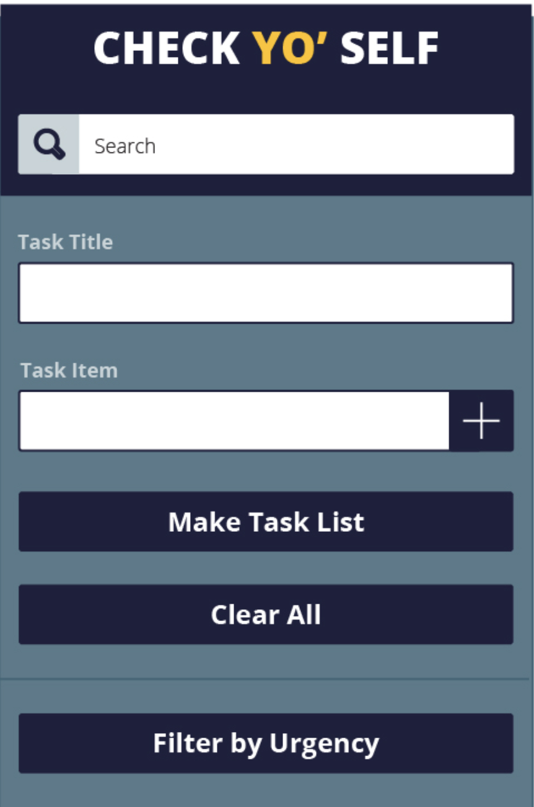
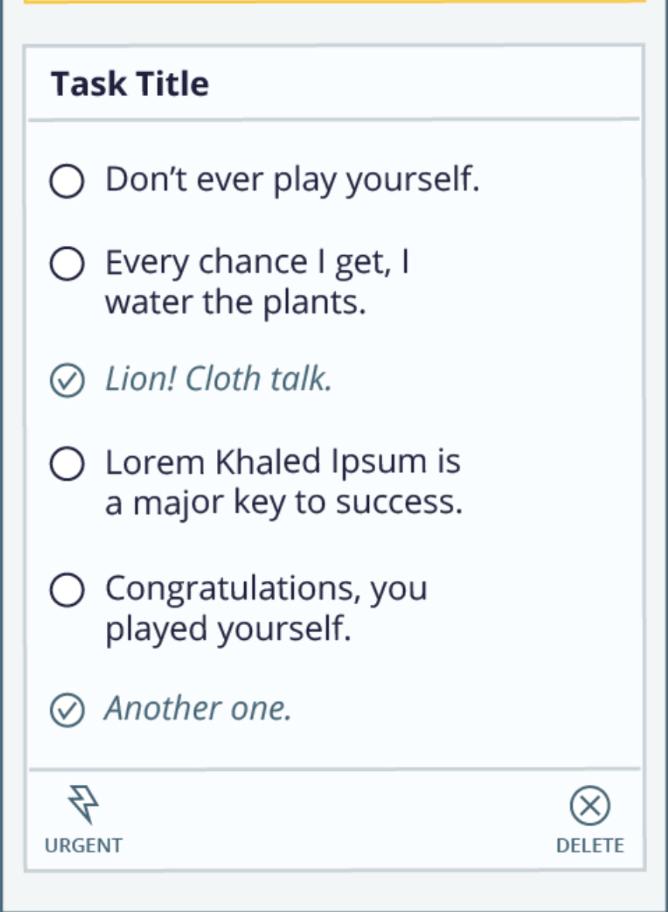

# Check Yo'Self Group Project
Learning Goals
- Solidify and demonstrate your understanding of:
clean & organized CSS styles
DRY JavaScript
localStorage to persist data
Iterate through/filter DOM elements using for loops
Understand the difference between the data model and how the data is displayed on the DOM
Ability to match/recreate a UI and create a great UX

- A todo-list.js file that contains a ToDoList class.
- ToDoList should have the following properties:

- id should be a unique identifier
- title is a string
- urgent is a boolean value
- tasks should be an array of task objects
- ToDoList methods must include, but are not limited to:
- constructor
- saveToStorage
- deleteFromStorage
- updateToDo (should update the to-do’s title and urgency)
- updateTask (should update a task’s content and if it has been completed)
- A task.js file that contains a Task class. We aren’t giving you any
 requirements about what methods or properties should be on it.
- A main.js file that contains all DOM related JavaScript

#### Default Laptop

#### Mobile Phone

#### Urgent Laptop

#### With Tasks

